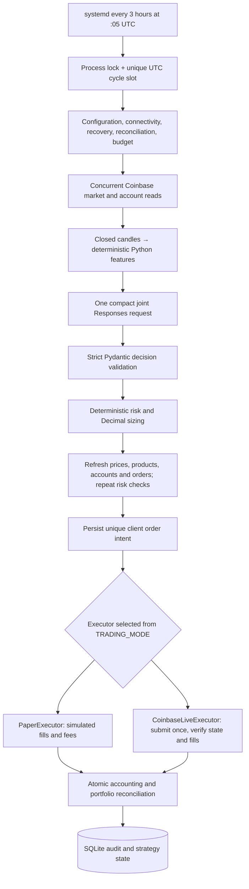

# trade-me-away

A small Python service for auditable, autonomous **spot** cryptocurrency trading on Coinbase
Advanced Trade. It collects current numerical data, calculates indicators locally, requests one
joint OpenAI decision, applies deterministic risk controls, and executes through a paper or live
adapter. SQLite holds the audit trail and strategy history. No web server or external database.

**Start with `TRADING_MODE=paper`.** This is the shipped and recommended configuration. The variable
is deliberately required: missing, invalid, uppercase, or ambiguous values fail startup. Credentials
never select a mode. `TRADING_MODE=live` selects real execution without a code change.

This is an initial implementation, not a validated profitable strategy. A successful cycle may
produce only HOLD decisions or reject every order. That is expected behavior.

## Architecture



The same orchestrator, schema, prompt, risk engine, and pre-execution refresh serve both modes.
The executor owns the active balance ledger and final execution effects. Paper mode still obtains
and reconciles actual Coinbase accounts, but uses its own persisted simulated balances for sizing.
Changing mode does not copy paper holdings into Coinbase or reset either ledger.

Modules in `src/trader` separate configuration, schemas, the Coinbase adapter, market collection,
features, portfolio accounting, prompting, Responses integration, risk, execution, costs, storage,
and orchestration. `AGENTS.md` records invariants for future changes.

## Install and first paper run

Use Python **3.12 or later** on Linux or macOS. The file lock uses Unix `flock`; systemd deployment
targets Linux. Keep the host clock synchronized.

```bash
git clone <your-repository-url> crypto-trader
cd crypto-trader
python3 -m venv .venv
source .venv/bin/activate
python -m pip install -e '.[dev]'
cp .env.example .env
cp config.example.yaml config.yaml
chmod 600 .env
```

Edit `.env` locally with your own OpenAI API key and Coinbase credential references. Leave
`TRADING_MODE=paper`. Edit the fee assumptions and risk limits in `config.yaml` for your account.
Do not paste credentials into YAML, source code, terminal commands, issue reports, or logs.

```bash
python -m trader doctor
python -m trader run
python -m trader show-state
python -m trader show-orders
python -m trader show-costs
```

`doctor` prints **TRADING MODE: PAPER** and checks configuration, database integrity/access, Coinbase
key permissions, product availability, portfolio mappings, actual account reconciliation, unresolved
orders, cost budgets, and OpenAI model access. It places no order and makes no generation request.
It may establish initial balance baselines or recover previously submitted orders through GETs.
It cannot prove that your account supports a particular model/reasoning/schema combination without
making a generation request; the first paper cycle exercises that path.

`run` performs one fresh cycle. It is not a background daemon. Both manual and scheduled runs claim
the current three-hour UTC slot; repeating a run in that slot fails with `DUPLICATE_CYCLE`, including
after a failed run or a mode change. Wait for the next slot. Do not erase database records to retry.

## Credentials and configuration

The application reads `.env` in its working directory. Existing process environment variables take
precedence. An alternate file can be supplied before the command:
`python -m trader --env-file /secure/path/trader.env doctor`.
Duplicate dotenv/YAML keys are rejected. Only `.env.example` contains committed placeholders.

Create a Coinbase **ECDSA/ES256 CDP key** for each mapped Advanced Trade spot portfolio. Coinbase's
current App authentication documentation requires this key type for its SDKs. Preserve the private
key's newlines; a quoted dotenv value containing escaped `\n` is supported.
[Coinbase authentication](https://docs.cdp.coinbase.com/coinbase-app/authentication-authorization/api-key-authentication).

Grant **view** permission and, for eventual live use with a mode-only switch, **trade** permission.
Do not grant transfer permission: startup rejects keys with that permission or an unknown permission
state. A view-only key works in paper mode; it must be replaced before live trading. Use a dedicated
strategy portfolio with USDC and only the configured crypto assets. Manually fund it before the
first run. This application has no deposit, conversion, transfer, or withdrawal operations.

CDP keys select their permissioned portfolio; the deprecated `retail_portfolio_id` order parameter
does not route orders for those keys. Startup compares the API's `portfolio_uuid` against your
configured environment reference and verifies account/order/fill mappings.
[Coinbase portfolio behavior](https://docs.cdp.coinbase.com/coinbase-app/advanced-trade-apis/guides/portfolios),
[create-order portfolio parameter](https://docs.cdp.coinbase.com/api-reference/advanced-trade-api/rest-api/orders/create-order).

Create an OpenAI API key with access to the configured model and set `OPENAI_API_KEY` locally.
Defaults are `gpt-6-luna` and reasoning effort `medium`. YAML or `OPENAI_MODEL` /
`OPENAI_REASONING_EFFORT` environment overrides select other values. A model change also requires an
explicit matching `llm.pricing.model` and rates; unknown pricing fails validation. Integration uses
the official SDK's Responses API with a strict JSON schema generated by Pydantic, followed by local
Pydantic validation. Responses have no tools, external context, or conversation history.
[Structured Outputs](https://developers.openai.com/api/docs/guides/structured-outputs).

Important configuration groups:

| Group | Meaning |
|---|---|
| `portfolios` | Environment variable references; independent initial paper cash per portfolio |
| `assets` | Any number of enabled spot `BASE-USDC` products mapped to portfolios |
| `market.candles` | Coinbase granularity and 80–350 bars per timeframe; required horizon coverage validated |
| `risk` | Exposure, order size, daily attempts/loss, cooldown, freshness, spread, confidence and movement limits |
| `execution` | IOC order type, configured taker fees, slippage, limit offset, simulated fill fraction, verification waits |
| `llm` | Model, reasoning effort, token/payload limits, bounded attempts, pricing and daily/monthly USD budgets |
| `TRADER_DB` | SQLite location; defaults to `var/trader.sqlite3` |

Exposure fractions refer to **the mapped portfolio's equity**, not the sum of all separately funded
portfolios. All assets in one portfolio share its cash and total crypto exposure limit. Daily loss
and order-count limits apply per portfolio; the API budget applies across all portfolios and modes.
Model output array order does not control execution: configured asset order does. Later assets see
the actual effects of earlier fills and may be reduced or rejected.

## Features and historical context

Defaults fetch 300 candles each at 5 minutes, 15 minutes, and 1 hour. The close grace of 180 seconds
allows publication time before selecting closed bars. Every timeframe must have continuous, valid
OHLCV history through its expected cutoff. The system never forward-fills missing candles.

Local features include 15m/1h/3h/6h/12h/24h/3d returns, EMA12/26 relationships, Wilder-style
exponentially smoothed RSI14 and ATR14, normalized ATR, 24-bar realized volatility, 12-bar volume
change, volume z-score, 72-bar high/low distances and drawdowns, 24-bar log trend slope per hour,
and spread. Returns use the finest configured timeframe with sufficient coverage. Volatility is
scaled to 24 bars, not annualized. All indicators use only closed data at the supplied cutoff.

The model gets compact features, current portfolio equity/cash/exposures, entry cost, unrealized and
realized strategy PnL, position age, last actual action, time since last fill, and recent trade count
and turnover. Raw candles remain in SQLite. Prior model rationales never enter later prompts.

Initial paper portfolios start with configured cash and zero crypto. Initial actual holdings are
accepted as the initial Coinbase baseline, with **unknown** entry basis/age. The service does not
invent those values from current prices. PnL on sales of unknown-basis inventory remains unknown.
Known strategy cost basis includes buy fees; realized PnL deducts sell fees. There is no tax accounting.

## Risk and reconciliation

The model selects only INCREASE, DECREASE, HOLD, or EXIT and a bounded exposure target. Local Decimal
arithmetic determines amounts, rounds to product increments, reserves estimated fees, and clamps
to cash, holdings, exchange constraints, exposure and notional limits. It never buys more to satisfy
a minimum size or sells more than the proposed reduction. A capped EXIT can execute only part of
the desired exit. Product minimums can leave dust.

Missing/stale/invalid data, low confidence, wide spread, outstanding orders or holds, daily loss,
excessive trade count, cooldown, exhausted cost budget, and reconciliation failure reject trading.
All rejections have machine-readable reasons. Daily order count includes submissions that reject or
cancel, conservatively bounding churn. The cooldown uses actual fills. Daily loss includes marked
unrealized changes and fees: the baseline is the previous UTC day's last observed equity, or the
first observation on initial activation. It is sampled every cycle, not a continuous stop-loss.

Immediately before execution the pipeline fetches fresh products, quotes, balances, and orders,
reconciles again, checks decision age/price movement, and repeats risk checks. It can shrink the order
but cannot expand it. It never asks the model again in response to changed conditions. A failed
refresh aborts the rest of that cycle.

The actual Coinbase balance checkpoint remains separate from both strategy ledgers. After initial
bootstrap, external deposits, withdrawals, manual trades, unexpected holdings, mapping changes,
or material discrepancies block trading in **both** modes. Unknown recent fills also block trading,
including a round trip that leaves balances unchanged. An absence longer than six days exceeds the
seven-day recent-fill reconciliation window and requires operator investigation. `reconcile` is
read-only at Coinbase and does not reset mismatches or silently adopt external changes.

SQLite uses WAL, full synchronous commits, foreign keys, unique cycle/client IDs, and atomic fill /
ledger / expected-balance updates. An OS lock prevents overlapping commands using the same database.
Use **one service instance and one durable database per set of portfolios**; a separate database
cannot coordinate with this instance. Back up SQLite with its backup API or `.backup`, not by
copying only the main file while WAL writes are active.

## Execution and switching to live

Paper execution models the current bid/ask, configured per-side slippage, taker commission, IOC
marketability, and a deterministic `paper_fill_fraction`. An unfilled IOC remainder is cancelled;
there are no simulated resting orders. It does not model order-book depth, queue priority, or market
impact. Fees are configurable estimates, not fetched fee-tier guarantees.

Default `limit_ioc` maps to the official SDK's `limit_order_ioc` (`sor_limit_ioc`). The limit is a
local bound around the refreshed bid/ask. `market_ioc` is an explicit option; market buys spend a
bounded quote amount and sells use base quantity. Market orders have no guaranteed fill price,
so preflight slippage/exposure estimates cannot cap adverse exchange price changes after submission.
The default IOC limit option avoids that price-bound limitation.

Live execution commits the unique client ID and complete intent **before** sending one order
creation request. Coinbase documents duplicate client IDs as returning the original order. A
submission exception triggers paginated order discovery and GET verification, never another POST.
If discovery is empty, the result stays unresolved because absence is not proof of non-submission.
[Coinbase client-order-ID contract](https://docs.cdp.coinbase.com/api-reference/advanced-trade-api/rest-api/orders/create-order).

An acknowledgment is not success. Live execution compares order identity, terminal/settled state,
filled quantity, value and fees with individually fetched fills, detects partial/cancelled/rejected
orders, commits fills once, and verifies resulting Coinbase balances. Delayed settlement or unknown
outcomes block subsequent orders and future cycles. Recovery checks the original order only, even
if the process has since switched to paper. It never resubmits or cancels an external order.

After paper testing and reviewing the database, fees and risk limits:

1. Stop the timer/service if installed; confirm no order outcome remains unresolved.
2. Change **only** `.env` to `TRADING_MODE=live` (assuming the key already has view+trade permissions).
   Remove a conflicting shell/service environment override if present.
3. Run `python -m trader doctor`. It prints **TRADING MODE: LIVE — REAL ORDERS ENABLED**.
4. In a fresh cycle slot, run `python -m trader run`, or restart the timer to wait for its next trigger.

Live uses actual Coinbase cash/holdings, not the paper balance. Switching back to `paper` selects
the existing paper ledger again. Switching mode does not bypass unresolved-order recovery.
Do not delete the database, change client IDs, or manually resubmit to clear uncertainty.

## API costs and retries

There is one logical joint decision request per cycle. Normally that is one HTTP Responses request;
transport failures, 429s, or 5xx errors may cause bounded retries of the same payload. Each attempt
is logged and reserved against the budget. Schema failures, refusals and incomplete output are not
retried. Safe Coinbase GETs use three attempts with exponential backoff; order POSTs never use that
retry helper. SDK automatic OpenAI retries are disabled.

The stable instruction prefix is separate from dynamic state. Prompt caching may apply but is not
assumed. Conservative preflight reserves UTF-8 byte count plus framing as an input-token upper bound
and configured maximum output tokens. Usage records include input, cached input, output, and
reasoning tokens, latency, IDs, status, model, effort and price schedule. Reasoning tokens are part
of output tokens and are not charged twice. Unknown-cost attempts retain the full reservation across
restarts. Uncached input is estimated at the greater of normal and cache-write pricing when the API
does not provide a separate write breakdown.

The example rates were checked on 2026-09-24: GPT-6 Luna standard input $0.10, cached input $0.01,
cache write $0.125, output $0.50 per million tokens. The service requests standard processing. These
are local estimates, not invoices; review rates before changing models, tiers, or regional endpoints.
[Official model pricing](https://developers.openai.com/api/docs/models/gpt-6-luna).

## Audit and operations

Default database: `var/trader.sqlite3`; lock: `var/trader.lock`. Structured JSON logs go to stdout /
stderr, captured by journald under systemd. Local log files, database/WAL files, secrets and caches
are ignored by Git. Files created by the CLI use a restrictive umask.

Tables include `trading_cycles`, `market_snapshots`, `computed_features`, `portfolio_snapshots`,
`model_requests`, `model_decisions`, `risk_results`, `order_intents`, `orders`, `fills`,
`strategy_state`, `api_usage`, `exchange_state`, `daily_marks`, and `reconciliation_events`.
Domain payloads are JSON; monetary values are decimal strings. Times are UTC. Orders and fills are
mode-tagged. A cycle ID connects all activity. Inspection commands work offline without Coinbase
connectivity; trading, doctor, and reconciliation perform startup checks.

```bash
python -m trader reconcile
sqlite3 var/trader.sqlite3 'SELECT cycle_id, mode, status, reason FROM trading_cycles;'
sqlite3 var/trader.sqlite3 'SELECT subject, payload_json FROM risk_results ORDER BY id DESC LIMIT 10;'
sqlite3 var/trader.sqlite3 'SELECT mode, status, order_id FROM orders;'
journalctl -u crypto-trader.service -n 100
```

An abrupt crash can leave a cycle marked RUNNING. The claimed slot prevents replay; the next fresh
slot performs order recovery before new trading. Nonterminal exchange orders are observed through
bounded polling; the service does not wait indefinitely or place replacement orders.

## systemd installation

Install the project and virtual environment at `/opt/crypto-trader`, or update the absolute paths in
the provided service. Keep `.env` and `config.yaml` there. On the Linux host:

```bash
sudo useradd --system --home /opt/crypto-trader --shell /usr/sbin/nologin crypto-trader
sudo install -d -o crypto-trader -g crypto-trader -m 0700 /opt/crypto-trader/var
sudo chown root:crypto-trader /opt/crypto-trader/.env
sudo chmod 0640 /opt/crypto-trader/.env
sudo install -m 0644 deploy/systemd/crypto-trader.service /etc/systemd/system/
sudo install -m 0644 deploy/systemd/crypto-trader.timer /etc/systemd/system/
sudo systemctl daemon-reload
sudo -u crypto-trader /opt/crypto-trader/.venv/bin/python -m trader doctor
sudo systemctl enable --now crypto-trader.timer
systemctl list-timers crypto-trader.timer
```

Run the doctor command from `/opt/crypto-trader`; ensure that user can read the installed code,
virtual environment and config. The service reads `.env` itself, so quoted multiline/escaped PEM
keys use the same parsing as the CLI. Only `var/` is writable under the hardened service.

The timer runs at 00:05, 03:05, …, 21:05 **UTC**. `Persistent=false` prevents catching up missed
triggers. `run --scheduled` also rejects launches outside boundary +5 through +20 minutes. There
are no failure-triggered restarts. On a restart the timer waits for the next future trigger.

## Adding another cryptocurrency or portfolio

Add another `assets` entry with a tradable `BASE-USDC` product and its portfolio name. There is no
three-asset limit. A new zero-balance product is added to an existing strategy ledger without resetting
cash/history. Keep enough configured candles to cover all return horizons. Larger universes may
require a larger prompt-byte/token budget and snapshot-skew allowance based on measured latency.

For separate custody, add a new `portfolios` entry referencing three new environment variable names,
then add those values locally. Each underlying portfolio UUID must be unique. Multiple assets may
share a portfolio/key, but two names must not refer to the same actual portfolio.

Removing/remapping a tracked asset or adding one with untracked nonzero holdings requires an audited
state migration; the service refuses to discard history or exposure automatically. Nonzero assets
outside the enabled universe cannot be safely valued and block trading.

## Troubleshooting and verification limits

| Reason | Next step |
|---|---|
| `INVALID_TRADING_MODE` / `AMBIGUOUS_ENV_FILE` | Set one exact `paper` or `live` value; check process overrides and duplicate keys |
| `CONFIGURATION_INVALID` | Check YAML fields, model/pricing match, candle coverage and missing placeholder values; raw config is intentionally not printed |
| `COINBASE_PORTFOLIO_PERMISSION_MISMATCH` | Verify the CDP key's actual portfolio UUID and view permission |
| `COINBASE_TRANSFER_PERMISSION_ENABLED_OR_UNKNOWN` | Use a key without transfer permission |
| `PRODUCT_IDENTITY_OR_TYPE_MISMATCH` / `PRODUCT_NOT_TRADABLE` | Verify regional product availability; USD aliases are never silently substituted for USDC |
| `CANDLE_DATA_INSUFFICIENT_OR_INVALID` / `STALE_QUOTE` | Check connectivity, host time and candle publication; do not fill missing data artificially |
| `COINBASE_HISTORY_AUTHENTICATION_REQUIRED` | Coinbase requires additional history authentication, including possible EU SCA; resolve account access before trading |
| `RECONCILIATION_FAILED` | Inspect reconciliation reasons and actual exchange activity; restore consistency through an audited operator review |
| `UNRESOLVED_PREVIOUS_ORDER` / `UNRESOLVED_EXECUTION` | Inspect the original client/exchange order IDs and run `reconcile`; never submit a replacement |
| `API_BUDGET_EXCEEDED` | Inspect actual usage and retained reservations; wait for the budget window or explicitly review limits |
| `DUPLICATE_CYCLE` / `CYCLE_ALREADY_RUNNING` | Wait for the next slot or existing process; do not remove the live lock/database |

Current official documentation and installed SDK signatures were inspected; implementation contracts
are exercised with mocks, including the official OpenAI SDK over a mocked HTTP transport. No real
credentials, authenticated account, funded trade, exchange settlement, regional USDC availability,
actual fee tier, or model account entitlement were available for end-to-end verification. Coinbase's
eventual consistency, product aliases, and history/SCA behavior must therefore be checked by `doctor`
and paper observation in your environment. Missing required metadata fails closed. Systemd units
must be installed/validated on Linux; development tests also run on macOS.

See [integration verification notes](docs/integrations.md) for the official endpoints and limits.

## Tests

```bash
pytest
ruff check .
ruff format --check .
```

Tests block outbound socket connections and replace Coinbase/OpenAI calls. Coverage prioritizes
malformed/stale/missing data, look-ahead prevention, schema rejection, sizing and limits, reconciliation,
locks, duplicate cycles/orders, API budgets/failures, uncertain submission, partial/rejected fills,
mode changes, recovery accounting, and complete joint paper cycles. Tests never require real keys
and never place a real trade.
